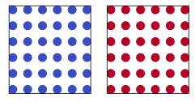
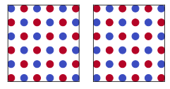
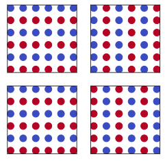

# Prediction App
This Django app lets the user supply trained model and input data and identifies the phase(label) of the given data. 

## Hamiltonian
This app is trained on the ordered and disordered spin configurations of a spin model described by the hamiltonian,
$$H = -J_{1}\sum_{\langle ij\rangle} S_{i}S_{j} - J_{2}\sum_{\langle \langle ij \rangle \rangle}S_{i}S_{i}$$
$S_{i} = \pm 1$ are the classical variables at each site and take two values. 
These classical variables are interacting with each other. 
The nearest neighboring spins interact via the interaction strength $J_{1}$ and the interaction between second nearest neighbouring site is represented by
$J_{2}$. The calculations are performed for a square lattice with linear dimension $L$ and number of sites $N$.
### Ferromagnet
For $J_{2} = 0$ and $J_{1} > 0$(interaction $J_{1}$ is ferromagnetic in nature) the energy is minimized when the product $S_{i}S_{j}>0$. One can say that the spin tends to align in the same direction. The two minimum energy configurations possible are shown below. One can thing of blue circle as +1 and red circle as -1.

### Anti-ferromagnet
For $J_{2} = 0$ and $J_{1}<0$(interaction $J_{1}$ is anti-ferromagnetic in nature) the energy is minimized when the product $S_{i}S_{j}<0$. In this case
spins tends to align in an anti-parallel or in an anti-ferromagnetic fashion. The two possible configurations possible are shown below.

### Stripe
When $J_{2} \neq 0$ and $J_{1} \neq 0$ the energy is minimized for the stripe configurations. For a square lattice the four possible stripe configurations are shown below.

## Convolutional neural network
A Convolutional Neural Network is used to peform the task of classification. The network is trained to differentiate between
ferromagnetic, anti-ferromagnet, stripe ordered and disordered phase. One can train model only in the deep ordered phases and use the model to make
predictions for the intermediate temperature. 

## Demo video
One can run the app like a standard Django app. The app first picks few configurations randomly and plots them and the ouput is a probability of two different phases over all the configurations that are used in the prediction stage.
The demo of the app can be found on this [Youtube](https://youtu.be/xj00o--9N2U) link.
